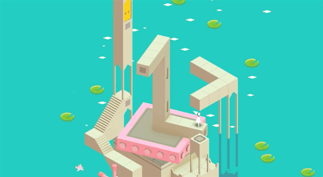

Головоломки на оптических иллюзиях
==================================

Описание этого практического задания не закончено.
Если вас заинтересовали примеры — обратитесь к преподавателю для обсуждения деталей.

Примеры:

- игра «Monument Valley».

