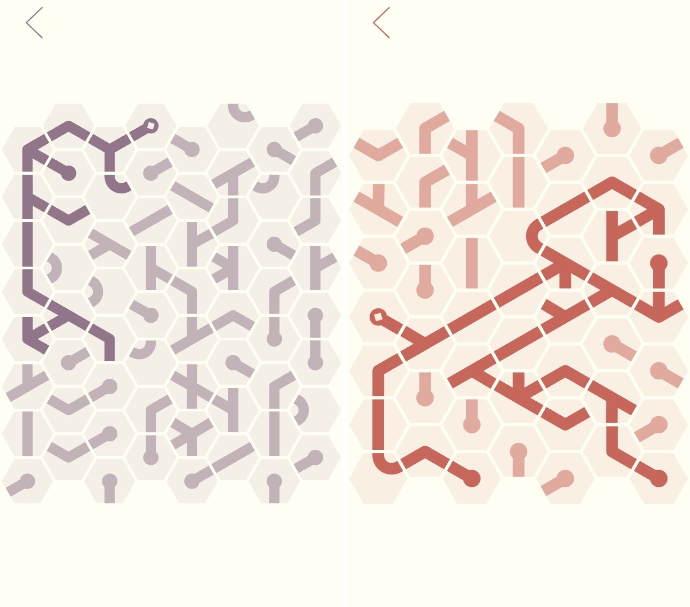
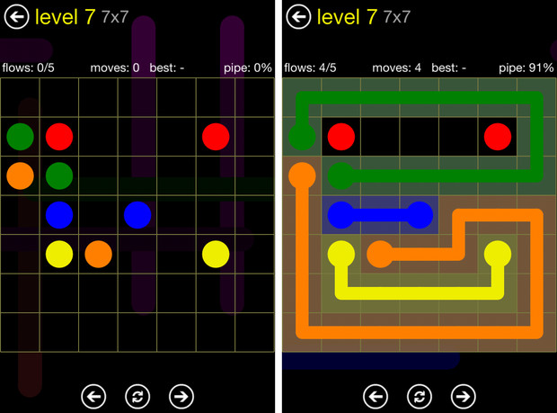
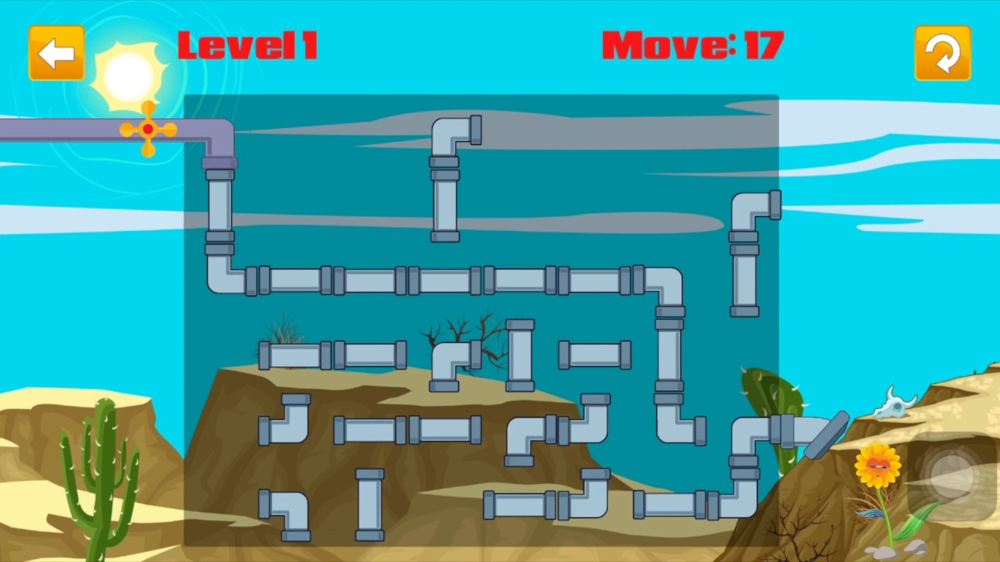

Водопроводчик
=============

Описание этого практического задания не закончено.
Если вас заинтересовали примеры — обратитесь к преподавателю для обсуждения деталей.

Примеры:

- игра «Noodles!»;
- игра «Flow»;
- игра «Plumber Pipe».

