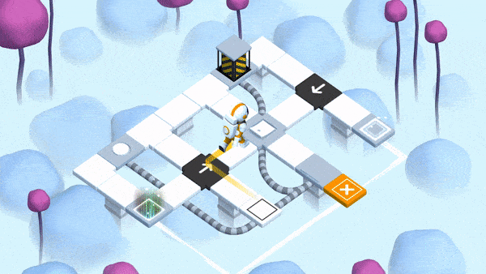

Головоломки с нелинейным временем
=================================

Описание этого практического задания не закончено.
Если вас заинтересовали примеры — обратитесь к преподавателю для обсуждения деталей.

Примеры:

- игра «Braid»;
- игра «Causality».

