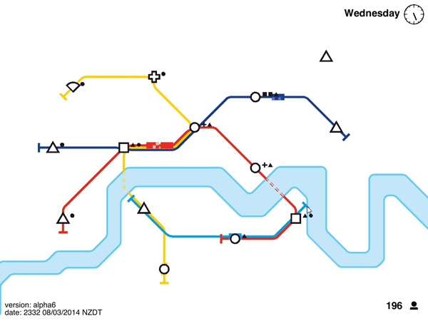

Транспорт
=========

Описание этого практического задания не закончено.
Если вас заинтересовали примеры — обратитесь к преподавателю для обсуждения деталей.

Примеры:

- игра «Minimetro» (конструктор метро);
- игра «Flight Control» (авиадиспетчер).

